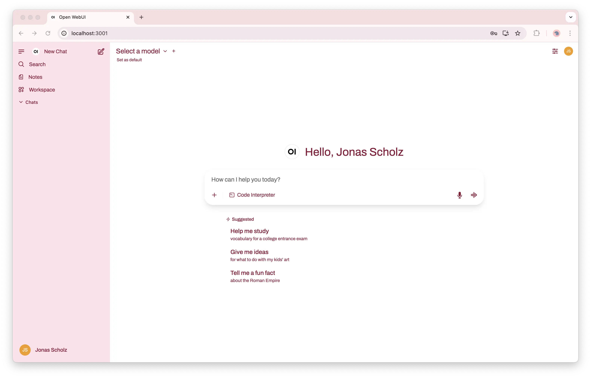

# Blackfuel theme for Open WebUI

A custom [Open WebUI](https://github.com/open-webui/open-webui) theme that matches the
**Blackfuel ("FUEL")** SaaS brand: near-black surfaces with a single neon-green accent
(`#d8ff3e`). The theme is tuned for Open WebUI's **dark mode**.

The styling lives entirely in [`custom.css`](./custom.css), which the
[`Dockerfile`](./Dockerfile) bakes into the official **Open WebUI 0.9.6** image at
`/app/build/static/custom.css` (Open WebUI loads it via the
`<link href="/static/custom.css">` in its `app.html`). The selectors are matched
against the 0.9.6 markup; expect to revisit them on a major Open WebUI upgrade.



```bash
docker build -t openwebui-blackfuel .

docker run -p 3000:8080 -e OPENAI_API_KEY=your_secret_key -v open-webui:/app/backend/data --restart always openwebui-blackfuel
```

Then open <http://localhost:3000> and switch the interface to **Dark** mode
(Settings → General → Theme) to see the brand surfaces.

## Brand reference

Tokens are taken from the Blackfuel SaaS frontend (`ai-platform/saas/frontend`):

| Role | Hex |
| --- | --- |
| Accent (neon green) | `#d8ff3e` |
| App background | `#050505` |
| Sidebar | `#0a0a0a` |
| Surfaces / inputs | `#121212` |
| Border | `#262626` |
| Text | `#d9d9d9` |

Fonts (loaded from Google Fonts at runtime): Inter (body), Rajdhani (headings),
JetBrains Mono (code), Orbitron (brand).
